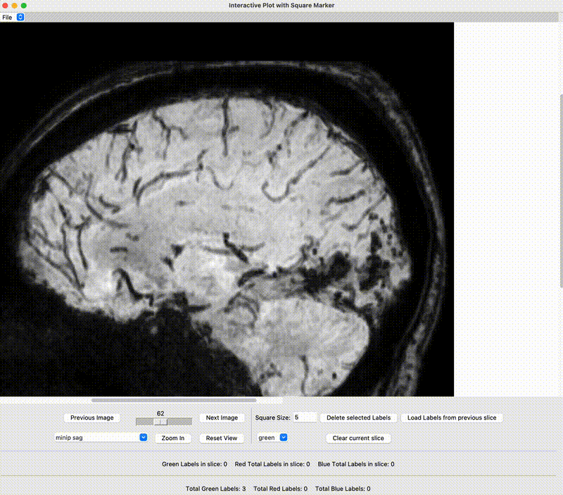

A tool to simplyfy the process of counting cerebral microbleeds in MRI scans, reading DICOM files.

The main challenge for the neurologist when counting microbleeds is keeping track of previous slices to avoid double-counting the same microbleed across multiple slices.

This project aims to streamline that process. By clicking on a microbleed in the image, a square is drawn around it with a solid line. When moving to the next slice, the user can import annotations from the previous slice. These imported annotations appear as dashed lines to indicate they are inherited from the previous slice, representing the same microbleed. As a result, each microbleed is counted only once in the total count.

Additionally, when an inherited microbleed disappears from view after a few slices, the user can delete it from the current slice. If the user deletes a microbleed that is linked to other slices, only the instance on the active slice is removed, leaving other slices unaffected.

This way the user can keep track of the microbleeds across slices and avoid double-counting them, wihout the burden of manually keeping track of them.

See the .gif for an example.

# Installation

# Features

# Features

# Developing

# 

